## 개요

`git cherry-pick`과 `git revert` 명령어에서 사용되는 `-m` 옵션은 머지 커밋(merge commit)을 처리할 때 필수적인 옵션이다. 잘 이해하지 않은 채 사용한 이 옵션에 대해서 정리해보았다.

## 목차

- [개요](#개요)
- [목차](#목차)
- [사용해야 하는 상황](#사용해야-하는-상황)
- [필요한 이유](#필요한-이유)
- [역할과 작동 방식](#역할과-작동-방식)
- [사용 예시](#사용-예시)
  - [cherry-pick 예시](#cherry-pick-예시)
  - [revert 예시](#revert-예시)
- [옵션 명시 여부에 따른 차이](#옵션-명시-여부에-따른-차이)
  - [`-m`을 명시하지 않는 경우:](#-m을-명시하지-않는-경우)
  - [`-m`을 명시하는 경우:](#-m을-명시하는-경우)
- [시각적 이해](#시각적-이해)
  - [`-m 1`과 `-m 2`의 관점 차이:](#-m-1과--m-2의-관점-차이)
- [결론](#결론)

## 사용해야 하는 상황

머지 커밋(두 개 이상의 브랜치가 합쳐진 커밋)을 cherry-pick하거나 revert할 때 반드시 `-m` 옵션을 사용해야한다. 머지 커밋은 두 개 이상의 부모 커밋을 가지고 있어서, Git은 어떤 부모를 "메인 라인"으로 간주해야 할지 알 수 없다.

## 필요한 이유

머지 커밋은 여러 부모 커밋을 가지고 있기 때문에, Git은 어떤 부모 커밋을 기준으로 변경사항을 적용하거나 취소해야 할지 알 수 없다. `-m` 옵션은 Git에게 "이 부모 커밋을 기준으로 변경사항을 적용/취소하라"고 지시하는 역할을 한다.

## 역할과 작동 방식

`-m` 옵션은 머지 커밋의 여러 부모 중 어떤 부모를 메인 라인으로 볼 것인지 지정한다:

- `-m 1`: 첫 번째 부모 커밋(일반적으로 머지된 타겟 브랜치, 주로 main/master)
- `-m 2`: 두 번째 부모 커밋(일반적으로 머지한 소스 브랜치, 주로 feature)

이 값에 따라 Git은 선택된 부모 커밋과 머지 커밋 간의 차이를 계산하여 적용하거나 취소한다.

## 사용 예시

### cherry-pick 예시

```bash
# M이 머지 커밋일 때, 첫 번째 부모(main)를 기준으로 변경사항 적용
git cherry-pick -m 1 M

# M이 머지 커밋일 때, 두 번째 부모(feature)를 기준으로 변경사항 적용
git cherry-pick -m 2 M
```

### revert 예시

```bash
# M이 머지 커밋일 때, main 브랜치 라인을 유지하고 머지된 변경사항 취소
git revert -m 1 M

# M이 머지 커밋일 때, feature 브랜치 라인을 유지하고 머지된 변경사항 취소
git revert -m 2 M
```

## 옵션 명시 여부에 따른 차이

### `-m`을 명시하지 않는 경우:

- 일반 커밋에서는 문제 없이 작동한다
- 머지 커밋에서는 다음과 같은 오류가 발생한다:

  ```
  error: commit abcdef123 is a merge but no -m option was given
  ```

### `-m`을 명시하는 경우:

- 머지 커밋에서 특정 부모를 기준으로 변경사항을 계산한다
- `-m 1`은 보통 "메인라인에 다른 브랜치의 변경사항을 적용했다"는 관점을 취한다 (가장 일반적인 사용)
- `-m 2`는 보통 반대 방향의 관점을 취한다 (드물게 사용)

## 시각적 이해

머지 커밋 구조:

[](https://www.mermaidchart.com/raw/a892619c-5c78-4e82-8299-1f8f9a4076ff?theme=light&version=v0.1&format=svg)

여기서 M은 머지 커밋이며:

- 첫 번째 부모(parent 1): 커밋 E (main 브랜치)
- 두 번째 부모(parent 2): 커밋 C (feature 브랜치)

### `-m 1`과 `-m 2`의 관점 차이:

[](https://www.mermaidchart.com/raw/a892619c-5c78-4e82-8299-1f8f9a4076ff?theme=light&version=v0.1&format=svg)

**`-m 1` 사용 시 (일반적인 경우):**

- 관점: main 브랜치가 기준선
- 효과: feature 브랜치의 변경사항을 적용(cherry-pick)하거나 제거(revert)

**`-m 2` 사용 시 (드문 경우):**

- 관점: feature 브랜치가 기준선
- 효과: main 브랜치에서 feature로 들어간 변경사항을 적용(cherry-pick)하거나 제거(revert)

## 결론

대부분의 워크플로우에서는 `-m 1`을 사용하는 것이 일반적이며, 이는 "메인 브랜치에 feature 브랜치의 변경사항을 적용/제거한다"는 의미이다. 올바른 `-m` 값 선택은 프로젝트의 브랜칭 전략과 워크플로우에 따라 달라질 수 있다.
