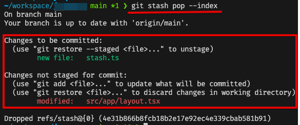

### # 배경

기능 추가를 하다 말고 서비스 운영 상의 이슈가 발생하면, 대응하기 위해서 브랜치를 전환한다. 지금까지의 작업이 커밋하기엔 애매한 단위의 작업이라면, 이 때 사용하기 적절한 git 명령어는 `git stash`이다. 이 명령어를 입력하면 진행중인 작업을 stack 구조로 이루어진 메모리 공간에 저장한다.

#### stash에 넣어둔지 오래된 작업 꺼내기

나는 `git stash`, `git stash pop` 이렇게 두가지만 사용했다. 그래서 stash로 저장한 작업 자체를 까먹는 경우가 대부분이었다. 또, stash에 저장해놓은 걸 알더라도 오래 묵혀둔 작업을 찾으려고 보니 기억이 나질 않았다. stash를 할 당시의 커밋 메시지로만 알 수 있기 때문에 그 이후의 작업에 대한 맥락 파악이 어렵다고 생각했다.


그와중에 문득 이런 생각이 들었다.

> 커밋 메시지처럼 **스태시 메시지**가 있으면?

git stash를 할 때 어떤 작업인지 설명하는 메시지가 있으면 좋겠다고 생각했다. 그러면 오래된 작업이라도 내용을 한번에 파악할 수 있기 때문에 쉽게 파악하여 빠르게 이어서 작업할 수 있다. 이외에도 어떤 명령어나 옵션이 있는지 파악하고 있으면 생산성에 도움이 될꺼라고 생각하여 공부해보기로 했다.

### # git stash 기본 명령어

아래와 같이 간단한 명령어로 `git stash`를 사용할 수 있다. 이를 통해서 커밋하지 않고도 작업을 잠시 저장해두었다가 다시 돌아와서 재개할 수 있다.

```bash
# 작업 저장
git stash

# 최근 stash로 (코드에 적용하고) 제거하기
# pop = drop + apply
git stash pop
```

이외에도 아래와 같은 명령어가 있다.

```bash
# stash 목록 보기
git stash list

# 최근 stash 내용 (코드에 적용하지 않고) 제거하기
git stash drop
```

### # 유용한 stash 기능

#### ✅ git stash push

`git stash` 와 동일하게 동작한다. 옵션도 동일해서 `git stash`로 사용하는게 더 편리하다. 자주 사용하는 옵션은 `-m`, `-u`, `-p` 등이 있다.

1. `-m <message>`: 스태시 메시지를 작성할 때 사용한다.

```bash
git stash -m "스태시 메시지"
```

2. `-u or --include-untracked`: untracked 파일도 stash에 포함.

- 기본적으로는 untracked 파일은 stash 대상에 포함되지 않는다. 해당 옵션을 명시하여 새로 만든 파일이나 추가한 이미지를 스태시 대상에 포함할 수 있다.

```bash
git stash -u
```

3. `-a`: .gitignore에 포함되는 파일도 스태시 대상에 포함.

- 자주 사용하진 않을 것 같은 옵션이다.

#### ✅ git stash apply

스태시에 저장했던 작업을 워킹 디렉토리에 반영할 때 사용한다. `stash pop` 과 달리 반영한 작업을 스태시에서 제거하지 않는다.

- **git stash pop**


- **git stash apply**
  

`git stash`는 스테이징 상태의 파일도 스태시에 저장한다. 그 이후에 해당 스태시를 불러오면 스테이징 상태였던 파일들도 모두 unstaged 상태로 워킹 디렉토리에 반영한다. `--index` 옵션을 사용하면 스태시에 저장하기 전에 스테이징 상태였던 파일들을 모두 스테이징 상태로 워킹 디렉토리에 반영한다.

```bash
git stash apply --index

# pop에서도 사용 가능한 옵션
git stash pop --index
```



#### ✅ git stash clear

명령어 그대로 스태시에 쌓인 모든 작업 내역들을 제거한다. 복구가 불가능하기 때문에 사용에 신중해야 한다.

#### ✅ git stash show

특정 스태시 내용을 볼 때는 아래와 같이 사용한다.

```bash
git stash show stash@{1}

# or
git stash show 1
```


더 자세한 변경 사항을 보여주는 `-p` 옵션 사용하면 아래와 같이 볼 수 있다.

```bash
git stash show 1 -p
```


#### ✅ git stash branch

```bash
git stash branch <새 브랜치 이름>
```

변경 사항을 스태시하고 새로운 브랜치로 체크아웃한 후, 해당 브랜치에서 스태시 항목을 적용하는 명령어이다. `git checkout -b` 또는 `git switch -c`와 내부 동작은 다르지만, 사용하는 입장에선 `변경 사항을 새로운 브랜치로 가져간다`는 점에서 동일하다.

#### ✅ git stash list

스태시 목록을 보여주는 명령어이다. `-p` 옵션을 사용하면 각 스태시의 세부적인 내용을 확인할 수 있다.

```bash
git stash list
git stash list -p
```


### # 알아두면 좋을 내용

#### ⚠️ git stash save

위에서 언급한 명령어 이외에도 `git stash save`가 있다. 하지만, 이 명령어는 deprecated 되었다. 따라서 사용하는 걸 권장하지 않는다. 대신 `git stash push`를 사용하면 된다.

[🔗 git-scm](https://git-scm.com/docs/git-stash)

> This option is deprecated in favour of git stash push.

### # 고찰

요즘은 현업에서 틈 나는대로 리팩터링을 하고 있다. 리팩터링은 운영 상의 이슈나 기능 추가 작업보다는 항상 우선순위가 낮다. 작업 단위를 잘게 나눠서 짧은 호흡으로 리팩터링을 해야하는 것이 좋지만, 가끔 하나의 커밋 단위가 이루어지기 전에 작업 전환이 필요한 경우가 있다. 이때, 과감하게 스태시하고 급한 작업을 먼저 처리한다.

이런 상황 말고도, 작업을 빨리 진행해야할 때 꽤 유용하다. 작업을 잘게 나누면 커밋 주기 또한 짧다. 커밋 메시지는 팀원이 봐도 이해하기 쉽게 작성을 해야한다. 따라서 커밋 메시지를 작성할 때 더 잘 작성하기 위한 고민을 하게 된다. 하지만 이 시간이 길어지면 작업의 흐름이 끊긴다. 이때 스태시 메시지를 내가 알아 볼 수 있는 정도로만 작성하여 저장하고, 나중에 하나씩 반영하면서 커밋 메시지를 작성할 수 있다. 그러면 흐름을 끊지 않고도 작업의 내용을 잘 설명하는 더 좋은 커밋 메시지를 작성할 수 있다. 실무에서 [커밋 메시지 주도 개발 방법론](https://gyuwon.github.io/blog/2021/04/04/commit-message-driven-development.html)과 함께 사용하면 개인적으로도, 팀으로도 더 좋은 시너지를 낼 수 있을 것 같다.

Git 명령어는 평소에 쓰는 것만 쓰게 된다. 하지만 조금 더 관심을 가지고 찾아보면 생산성을 개선할 수 있는 많은 기능들이 있다. 나는 이런 부분에서 생산성을 개선할 때, 성취감을 느낀다. 앞으로 더 좋은 팁을 알게 되면 또 Git에 관련된 내용으로 포스팅을 해봐야겠다.

### 🔗 참고자료

- [[Git] git stash 명령어 사용하기 - Heee's Development Blog](https://gmlwjd9405.github.io/2018/05/18/git-stash.html)
- [git stash - Saving Changes | Atlassian Git Tutorial](https://www.atlassian.com/git/tutorials/saving-changes/git-stash)
- [Git - git-stash Documentation](https://git-scm.com/docs/git-stash)
