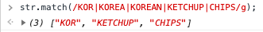
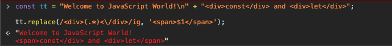
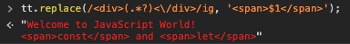

### # 정규표현식

정규표현식(정규식)은 특정한 규칙을 가진 문자열의 집합을 표현하는 데 사용하는 형식 언어이다. 정규표현식을 이용하면 문자열 검색, 교체가 가능하기 때문에 웹사이트의 사용자 입력을 검사하거나, 이메일 주소, URL, 전화번호 등의 문자열 찾는 것에 매우 유용하다.

### # 정규식 만들기

정규식을 만드는 방법은 리터럴 문법을 이용하는 방법과 RegExp 생성자로 만드는 방법이 있다. 리터럴 문법을 이용하여 정규식을 만드는 것이 더 간편하며, 동적 정규표현식을 만들 때에는 RegExp 생성자를 이용한다.

```js
const regByLiteral = /string/; //리터럴 방식
const regByConstructor = new RegExp("string"); //생성자 방식
```

### # 정규식 검색/교체

정규식을 검색하는 방법은 String.prototype.match 메소드와 RegExp.prototype.test 메소드를 이용하는 방법이 있고, 교체하는 방법으로는 String.prototype.replace가 있다.

주어진 문자열 str에서 대소문자 상관없이 다섯 글자 이상의 문자열을 찾는 예제를 통해서 살펴보겠다. 아래 예제에서 등장하는 메타 언어는 다음 다음 챕터에서 알아보겠다. 메소드의 사용법에 대해서만 이해하고 넘어가자.

```js
const str = "Hello, my name is Stefan";
```

```js
//match 메소드를 이용한 방법
str.match(/\w{5,}/gi);

//["Hello", "Stefan"] 배열 형식으로 출력된다.

str.match(/\w{10,}/gi);
//정규식이 찾는 문자열에 해당하지 않는다면, null이 반환된다.
```

```js
//test 메소드를 이용한 방법
/\w{5,}/gi.test(str);

//true

/\w{11,}/gi.test(str);

//false (11글자 이상의 문자가 없다. 따라서 false 반환)
```

```js
//replace 메소드를 이용하여 교체하기
str.replace(/\w{5,}/gi, "****");

// "**** my name is ****" 문자열 형식으로 해당 문자열을 반환한다.

str.replace(/\w{10,}/gi, "****");

//정규식에 해당하는 문자열이 없다면, 기존의 문자열을 그대로 반환한다.
//"Hello, my name is Stefan"
```

### # 정규식의 입력 소비

정규식은 무조건 문자열의 왼쪽에서 오른쪽으로 검색하면서 찾는 값이 존재할 가능성을 판단한다. 가능성이 없는 경우에는 바로 해당 문자를 소비하고, 가능성이 있으면 소비하지 않고, 계속 진행한다. 그러다 일치하는 문자열을 찾으면 찾은 것을 모두 소비한다. 예제를 통해서 확인해보자.

```js
const target = ["KOR", "KOREA", "KOREAN", "KETCHUP", "CHIPS"];

const str = "KOREANKETCHUPPCHIPS";
```

문자열 str에서 target에 담겨있는 값을 찾는 예제이다. 정규식은 무조건 문자열의 왼쪽에서 오른쪽으로 본다고 앞서 언급했다.

K O R E A N K E T C H U P P C H I P S<br>
👆K로 시작하는 문자열이 target에 존재하므로 소비하지 않는다.

K O R E A N K E T C H U P P C H I P S<br>
&nbsp; 👆 "KO" 가능한 문자열이 있다. -> 소비하지 않는다.

K O R E A N K E T C H U P P C H I P S<br>
&nbsp; &nbsp; &nbsp; 👆 "KOR" 문자열을 찾았다. "KOR"을 한번에 소비한다.

K O R E A N K E T C H U P P C H I P S<br>
&nbsp; &nbsp; &nbsp; &nbsp; &nbsp; 👆 E로 시작하는 문자열이 없다. 소비한다.

K O R E A N K E T C H U P P C H I P S<br>
&nbsp; &nbsp; &nbsp; &nbsp; &nbsp; &nbsp; &nbsp; 👆 A로 시작하는 문자열이 없다. 소비한다.

K O R E A N K E T C H U P P C H I P S<br>
&nbsp; &nbsp; &nbsp; &nbsp; &nbsp; &nbsp; &nbsp; &nbsp; &nbsp; 👆 N로 시작하는 문자열이 없다. 소비한다.

이러한 방식으로 문자열을 검색한다. 따라서 "KOR", "KETCHUP", "CHIPS"를 찾을 수 있다. "KOREA", "KOREAN"은 "KOR"을 찾자마자 모두 소비하기 때문에 "EA", "EAN"으로만 인식한다. 따라서 찾지 못한다.



### # 메타 문자 및 정규식 작성 방법

정규식은 /로 시작해서 /로 끝난다. 정규식 뒤에 오는 문자를 플래그(flag)라고 하는데, 자주 쓰이는 플래그에는 i와 g, m이 있다. i는 대소문자를 가리지 않는다는 의미이고, g는 전체 범위를 검색하라는 의미이다. g플래그가 없으면 일치하는 것중 첫 번째만 반환된다. m은 줄바꿈이 있어도 계속해서 찾는다는 것을 의미한다.

정규식에서 \|는 OR을 뜻하는 메타 문자이며, [ ]는 범위 설정할 때 사용한다.

_숫자를 찾는 정규식_

다음 문자열에서 숫자를 찾는 정규식을 작성해보자.

```js
const str = "Hello79 ";
```

```js
const findNum = str.match(/0|1|2|3|4|5|6|7|8|9|/g); // 비효율적이다.
```

```js
const findNUm = str.match(/[0123456789]/g); //또는

const findNum = str.match(/[0-9]/g); //이와 같이 쓸 수 있다.
```

```js
const findAll = str.match(/[\-0-9a-z.]/gi); //문자와 숫자를 모두 찾는 정규식

const findAll = str.match(/[.a-z0-9\-]/gi); //와 같이 쓸 수 있다.

/* 하이픈(-)은 esc해야한다. esc안하는 경우에는 범위를 표시하는 메타문자로 간주하기 때문이다.
 *
 * esc는 해당 문자 앞에 역슬래쉬(\)를 하면 된다.
-------------------------------------------------------------------------*/
```

```js
//특정 문자 또는 범위를 제외하고 찾을때 ^를 이용한다.
const findExc = str.match(/[^\-0-9a-z.]/); //문자와 숫자를 제외하고 마지막 인덱스에 위치한 공백을 찾는다.
```

*자주 쓰는 문자셋*은 줄여서 쓸 수 있다. 다음에서 살펴보자.

| 문자셋 |  같은 표현   |                          설명                          |
| :----: | :----------: | :----------------------------------------------------: |
|   \d   |    [0-9]     |                 모든 숫자를 검색한다.                  |
|   \D   |    [^0-9]    |             모든 숫자를 제외하고 검색한다.             |
|   \s   | [ \t\v\n\r]  |        스페이스, 탭, 세로 탭, 줄바꿈 검색한다.         |
|   \S   | [^ \t\v\n\r] |    스페이스, 탭, 세로 탭, 줄바꿈 제외하고 검색한다.    |
|   \w   |  [a-zA-Z_]   | 하이픈과 마침표를 제외하고 알파벳 대소문자를 검색한다. |
|   \W   |  [^a-zA-Z_]  |                       \w와 반대.                       |

### # 반복(수량자)

얼마나 많이 일치해야 하는지 지정할 때 쓴다.

```js
const findMany = str.match(/[0-9][0-9][0-9]|[0-9][0-9]|[0-9]/);
```

한 자리, 두 자리, 세 자리 숫자가 연속되는 것을 찾는다. 정규식의 특성상 조건에 해당하는 문자열을 찾았을 때, 바로 소비하기 때문에 세 자리, 두 자리, 한 자리를 찾는 정규식 순서대로 썼다.

```js
const findMany = str.match(/[0-9]+/);
```

위의 정규식은 네 자리가 연속되는 숫자는 찾지 못하기 때문에 '+'를 써서 숫자가 연속하는 경우를 찾아낸다.

이 밖의 경우에도 반복되는 내용을 찾을 때 중괄호{}를 활용한다. {n}은 정확히 n개의 문자가 연속하는 경우를 찾아낸다. 위에서 언급한 \d를 활용하여 \d{5}와 같이 쓰면 다섯 자리의 숫자를 찾아낼 수 있다. 대표적인 예로 우편번호가 있다. 우편번호는 항상 다섯 자리로 이루어져 있기 때문에 정규식 /\d{5}/로 쉽게 찾아낼 수 있다.

n개 이상의 문자를 찾아내는 정규식은 {n,}이다. n뒤에 ,를 붙이면 n개 이상의 문자를 찾아낼 수 있다. 세 자리 이상 연속하는 문자 찾기를 아래의 예제와 살펴보자.

```js
const findChar = str.match(/\w{3,}/gi);
```

대소문자 구분없이 전체 범위에서 세 자리 이상 연속하는 문자를 찾는다.

위에서는 정확히 n개로 이루어진 문자와 n개 이상으로 이루어진 문자를 찾는 방법을 살펴보았다. 찾는 글자 수의 범위를 지정하여 찾을 수도 있다. n개 이상, m개 이하의 문자 또는 숫자를 찾을 때에는 {n, m}와 같이 표기한다. 아래에는 3자리 이상, 5자리 이하의 갯수로 연속하는 숫자를 찾는 정규식을 표현해보았다.

```js
const findNum = str.match(/\d{3,5}/);
```

지금까지 살펴본 반복 메타 문자를 정리해서 살펴보자.

| 반복 메타 문자 |               의미               |    예시     |                             설명                              |
| :------------: | :------------------------------: | :---------: | :-----------------------------------------------------------: |
|      {n}       | n개 만큼 반복되는 문자/숫자 찾기 |   /\d{5}/   |                  다섯 자리 숫자를 검색한다.                   |
|      {n,}      | n개 이상 반복되는 문자/숫자 찾기 |  /\w{6,}/   |              여섯 자리 이상의 알파벳을 검색한다.              |
|     {n,m}      |        n개 이상, m개 이하        |  /\d{3,5}/  |        세 자리 이상 다섯 자리 이하의 숫자를 검색한다.         |
|       ?        |  (? 앞의 문자/숫자의) 존재여부   | /[a-z]\d?/  |     알파벳 소문자가 있고 그 뒤의 숫자의 존재를 검색한다.      |
|       \*       |  (\* 앞의 문자/숫자의) 반복여부  | /[a-z]\d\*/ |     알파벳 소문자가 있고 그 뒤의 숫자의 반복을 검색한다.      |
|       +        | (+ 앞의 문자/숫자의) 반복을 표현 | /[a-z]\d+/  | 알파벳 소문자가 있고 그 뒤의 숫자가 반복되는 경우를 검색한다. |

<br>

### # 마침표와 이스케이프

마침표(.)는 줄바꿈 문자를 제외한 모든 문자에 일치하는 메타 문자이다. 입력 소비를 할 때 주로 사용한다. 이스케이프( \ )는 메타 문자로 지정되어 있는 문자를 메타 문자가 아닌 문자 그대로의 값으로 변환할 때 쓰인다.

```js
const gugudan = "(9 * 9.0) = 81";

const find = gugudan.match(/\(\d \* \d\.\d\) = \d+/); //출력 "(9 * 9.0) = 81"
```

\*와 .는 정규식에서 메타 문자로 사용되고, (와 )는 정규식에서 그룹이나 룩어헤드 등을 나타낼 때 쓰이기 때문에 이스케이프( \ )를 하여 그대로의 문자로 사용할 수 있다.

### # 그룹

지금까지는 문자 하나를 다뤄왔다. 그룹을 이용하면 하나의 정규 표현식을 만들어 단위로 취급하여 다룰 수 있다. 그룹의 종류는 두 가지로 나눌 수 있다. 첫번째는 논캡쳐링 그룹(non-capturing group)이고, 두번째는 캡쳐링 그룹(capturing group)이다. 캡쳐링 그룹은 정규식으로 검색한 문자열을 찾은 후에 그 결과를 나중에 쓸 수 있도록 저장해놓는 방식이고, 논캡쳐링 그룹은 검색 결과를 따로 저장해두지 않는 방식이다. 논캡쳐링 방식이 성능상의 이점이 있으며, 여기서는 논캡쳐링 그룹을 먼저 살펴보겠다.

논캡쳐링 그룹은 (?:[표현식])의 형태로 만들 수 있으며, 캡쳐링 그룹은 ([표현식])의 구조를 갖는다. 논캡쳐링 그룹의 경우, 검색한 결과를 다시 사용할 수 없다. 캡쳐링 그룹의 경우에는 \1과 같은 변수를 이용해서 캡쳐링한 검색 결과를 재참조할 수 있다.

아래의 예제를 통해서 도메인을 찾아보자.

```js
const text = "Visit eotkd4791.github.io today!";

const findMatch = text.match(/\w+(?:\.com|\.github\.io|\.org)/i); //eotkd4791.github.io
```

문자로 시작하고, .com, .github.io, .org로 이루어진 문자열을 찾아내는 정규식이다.

### # 적극적 일치(greedy matching)와 소극적 일치(lazy matching)

정규식에서 매우 중요한 개념이다. 정규식은 기본적으로 적극적 일치 기반의 검색을 한다. 예제를 통해서 정규식의 기본적인 특성을 파악해보자.

```js
const tt =
  "Welcome to JavaScript World!\n" + "<div>const</div> and <div>let</div>";
```

```js
tt.replace(/<div>(.*)<\/div>/gi, "<span>$1</span>");
```



다음과 같이 \<span\>const\</div\> and \<div\>let\</span\>으로 나온다. 기본적인 정규식은 적극적 일치 기반의 검색을 한다고 앞서 언급했다. 정규식은 \<div>를 만나면 \</div\>를 못 찾을 때까지 확장하여 검색을 진행한다. 기존의 문자열에는 \</div\>가 두 개 있다. 따라서 정규식은 뒤의 \</div\>를 검색할 때 비로소 일치한다고 판단하고, 문자열을 교체한다.

그렇다면 어떻게 이 문제를 해결할 수 있을까? 아래의 예제로 살펴보자.

```js
tt.replace(/<div>(.*?)<\/div>/gi, "<span>$1</span>");
```



정규식 내부의 그룹에 ?를 하나 추가했다. \*연산자 뒤에 ?를 쓰면 소극적 일치를 의미한다. 즉 \<div>태그 뒤로 오는 문자열을 $1에 담고 \</div\>를 만나자마자 바로 일치하는 것을 찾았다고 판단한다. 또한 적극적 일치와 달리 검색 범위를 확장하려고 하지 않는다.

### # 역참조(backreference)

그룹을 이용한 테크닉 중에 하나이다. 팰린드롬 문자열처럼 거꾸로 뒤집어도 원본과 같은 결과를 갖는 문자열을 검색할 때나, 따옴표의 짝을 맞출 때에 사용한다.

```js
const note =
  "We are looking for an album made by ABBA! Text me if you are interested! -ANNA-";

const findSub = note.match(/([A-Z])([A-Z])\2\1/g);
```

위의 예제 코드를 살펴보자. 대문자 알파벳을 찾는 첫번째 그룹(괄호)의 검색 결과가 \1에 담기고, 두번째 그룹(괄호)의 검색 결과가 \2에 담긴다.

### # 그룹 교체

그룹을 이용한 교체 테크닉이다. 예제를 통해서 이해해보자. \<a> 태그에서 href가 아닌 속성을 전부 제거하는 정규식을 작성하였다.

```js
let html = '<a class="del" href="/alive">fresh</a>';

html = html.replace(/<a.*?(href=".*?").*?>/, "<a $1>");
```

href속성을 그룹으로 묶어서 캡쳐링해두고, 캡쳐링한 내용을 다시 a태그에 삽입하는 정규식이다. 위에서도 간단하게 언급했지만, 정규식에서의 그룹은 \숫자와 같이 나타내고, 교체할 문자열에서는 $숫자가 그룹을 나타낸다. 여기서 숫자에는 그룹 번호가 들어간다.

이외에도 그룹을 교체하는 몇 가지 팁이 있다.

```js
const name = "You dae Sang";
```

일치하는 것 앞에 있는 전부를 참조하는 $`

```js
name.replace(/dae/, "($`)"); //출력 "You (You ) Sang"
```

일치하는 것을 그대로 참조하는 $&

```js
name.replace(/dae/, "($&)"); //출력 "You (dae) Sang"
```

일치하는 것 뒤에 있는 전부를 참조하는 $' (`따옴표가 겹치지 않게 문자열을 구성하는 따옴표는 큰따옴표(")로 써주는 것이 좋다.`)

```js
name.replace(/dae/, "($')"); //출력 "You ( Sang) Sang"
```

$기호 자체가 필요할 때에는 $$처럼 두번 써준다.

```js
name.replace(/dae/, "($$)"); //출력 "You ($) Sang"
```

### # 위치 지정

특정 문자열로 시작 또는 끝나는 문자열로 검색할 수 있습니다. 여기서 기준이 되는 "특정 문자(열)"을 앵커(anchor)라고 한다. 앵커에는 문자열의 맨 처음을 나타내는 ^와 맨 끝을 나타내는 $가 있다. 앵커와 m플래그를 이용하여 줄바꿈이 있는 문자열에서도 검색을 할 수 있다.

```js
const seasons = "Spring picnic\nSummer Vacation\nAutumn trip\nWinter";

const first = seasons.match(/^\w+/gm); // 출력 ["Spring", "Summer", "Autumn", "Winter"]

const last = seasons.match(/\w+$/gm); // 출력 ["picnic", "Vacation", "trip", "Winter"]
```

### # 단어 경계 일치

단어 경계는 특정 알파벳이나 숫자로 시작하는 부분, 끝나는 부분을 설정해서 텍스트 내부의 "연속하는" 문자열을 찾아낼 때 유용한 방법이다. 단어 경계 메타 문자는 `\b`와 `\B`가 있으며 앵커와 마찬가지로 입력을 소비하지 않는다. 다음 예제를 통해서 자세히 살펴보자.

```js
const emails = [
  "eotkd4791@gmail.com",
  "My email is eotkd4791@gmail.com",
  "Do not hesitate to email me, mine is eotkd4791@gmail.com",
];
```

```js
const substractEmail =
  /\b[a-z][a-z0-9._-]*@[a-z][a-z0-9_-]+\.[a-z]+(?:\.[a-z]+)?\b/gi;
emails.map((s) => s.replace(substractEmail, '<a href="mailto:$&">$&</a>'));

/* 출력 결과
 * "<a href="mailto:eotkd4791@gmail.com">eotkd4791@gmail.com</a>"
 *
 * "My email is <a href="mailto:eotkd4791@gmail.com">eotkd4791@gmail.com</a>"
 * *
 * "Do not hesitate to email me, mine is <a href="mailto:eotkd4791@gmail.com">eotkd4791@gmail.com</a>"
 */
```

_출력 결과를 살펴보면 `$&` 주위의 문자가 소비되지 않았기 때문에 `$&`에 포함되지 않는다._

### # 룩어헤드(lookahead)

룩어헤드란 전방 탐색을 뜻한다. 작성한 정규식에 일치하는 영역이 존재하여도 그 값이 제외되어서 나오는 검색 방법이다. `(?=[표현식])`과 같이 쓰며, 이러한 룩어헤드를 긍정형이라고 한다. 부정형 룩어헤드는 `(?![표현식])`와 같이 쓴다. 하위 표현식 뒤에 이어지지 않는 것만 찾을 때 부정형 룩어헤드를 쓴다. 룩어헤드는 실무에서 보통 비밀번호 유효성 검사시에 많이 쓴다.

비밀번호 유효성 검사를 하는 예제로 룩어헤드를 이해해보자. 비밀번호에는 대문자, 소문자, 숫자가 최소 하나씩은 포함되어야 하며, 한글은 쓸 수 없다고 가정하자.

```js
function validPassword(p) {
  return (
    /[A-Z]/.test(p) &&
    /[a-z]/.test(p) &&
    /[0-9]/.test(p) &&
    /[^a-zA-Z0-9]/.test(p)
  );
}
//위의 정규식을 룩어헤드를 이용하여 줄이면 다음과 같이 된다.

function validPassword(p) {
  return /(?=.*[A-Z])(?=.*[0-9])(?=.*[a-z])(?!.*[^a-zA-Z0-9])/.test(p);
}
```

룩어헤드 이외에도 후방 탐색을 뜻하는 룩비하인드(lookbehind)가 존재하며 룩어헤드와 룩비하인드를 통틀어서 룩어라운드(lookaround)라고도 한다. 룩어헤드와 룩비하인드는 각각 긍정형과 부정형으로 나뉜다.

### # 동적으로 정규식 만들기

사용자의 이름이 배열에 저장되어 있을 때, 문자열에서 배열에 일치하는 이름을 찾는 상황에서 이용할 수 있다.

```js
const labourers = ["stefan", "james", "cornor", "dew", "ha"];

const diary =
  "Labourer @stefan got up at 6am, " + "@ha and @dew were preparing to work";

const labRegExp = new RegExp(`@(?:${labourers.join("|")})\\b`, "g"); //단어 경계 메타 문자 b앞 \\두개 표시. 정규식 리터럴 b로 인식하는 것을 방지하기 위함.

diary.match(labRegExp);

//결과  ["@stefan", "@ha", "@dew"]
```

정규식 리터럴로는 사용자의 이름을 알아낼 수 없기 때문에 정규식 생성자를 이용하여 동적으로 정규식을 작성하였다.

다음 포스팅엔 정규표현식을 어떻게 적용하는지 알아보겠다.

### # 참고 자료

- Learning JavaScript Ethan Brown 저, 한선용 역
- [엿장구이님의 블로그](https://aftersiesta.tistory.com/3)
