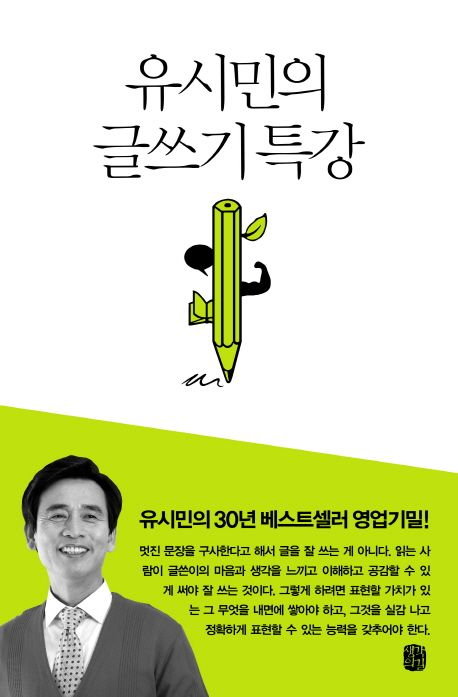

글쓰기는 단순한 감상의 나열이 아니라, 논증과 설득의 과정이라는 점이 인상적이었다. 책에서 강조하는 바는 명확하다. 취향의 고백과 주장을 구별하고, 주장은 반드시 논증해야 한다는 것이다. 이는 글을 읽는 독자가 논리적으로 이해하고 공감할 수 있도록 만드는 핵심 원칙이라고 생각한다. 또한, 좋은 글을 쓰기 위해서는 처음부터 끝까지 주제에 집중해야 한다. 이를 위해 필요한 기초 연습으로 ‘발췌’와 ‘요약’의 중요성을 강조한 부분이 특히 와닿았다. 발췌는 중요한 부분을 선택하는 과정이고, 요약은 핵심을 추리는 과정이다. 발췌가 물리적 작업이라면, 요약은 화학적 작업이라고 표현한 점이 흥미로웠다. 이러한 훈련을 반복하다 보면 자연스럽게 논리적인 글쓰기에 익숙해질 수 있을 것이다.

더불어, 문학이 아닌 글쓰기는 예술이 아니라 공학이라는 점도 깊이 공감했다. 감성적인 표현보다 논리적 구조가 중요하며, 이를 위해서는 단순히 감각에 의존하기보다 체계적인 연습이 필요하다는 것이다. 그 과정에서 많이 읽고, 많이 써보는 것이 가장 효과적인 방법이라는 점도 다시금 상기할 수 있었다.

문장의 구성에 있어서도 몇 가지 실용적인 조언이 있었다. 예를 들어, 한 문장에는 주어와 술어가 하나씩만 있는 단문을 주로 사용하고, 꼭 강조해야 하는 문장에서만 복문을 사용하는 것이 좋다는 점이다. 또한, 일본어에서 유래된 토씨(조사)와 피동형 문장을 줄이는 것이 글을 더 명확하게 만드는 데 도움이 된다고 한다. 이러한 작은 습관을 바꾸는 것만으로도 글의 가독성과 전달력이 크게 향상될 것 같다. 단문 사용과 피동형 문장을 줄이는 것은 바로 적용이 가능하다. 따라서 이 두가지만 의식하고 글을 써봐도 이전과는 확연한 차이가 보인다.

이번 『글쓰기 특강』을 통해, 글쓰기 실력을 키우기 위해서는 단순히 감각에 의존하는 것이 아니라 논리적인 사고와 체계적인 연습이 필요하다는 점을 다시금 깨달았다. 앞으로 글을 쓸 때 논증을 명확히 하고, 발췌와 요약을 적극적으로 활용하며, 문장의 구조를 신경 써야겠다는 생각을 했다.
